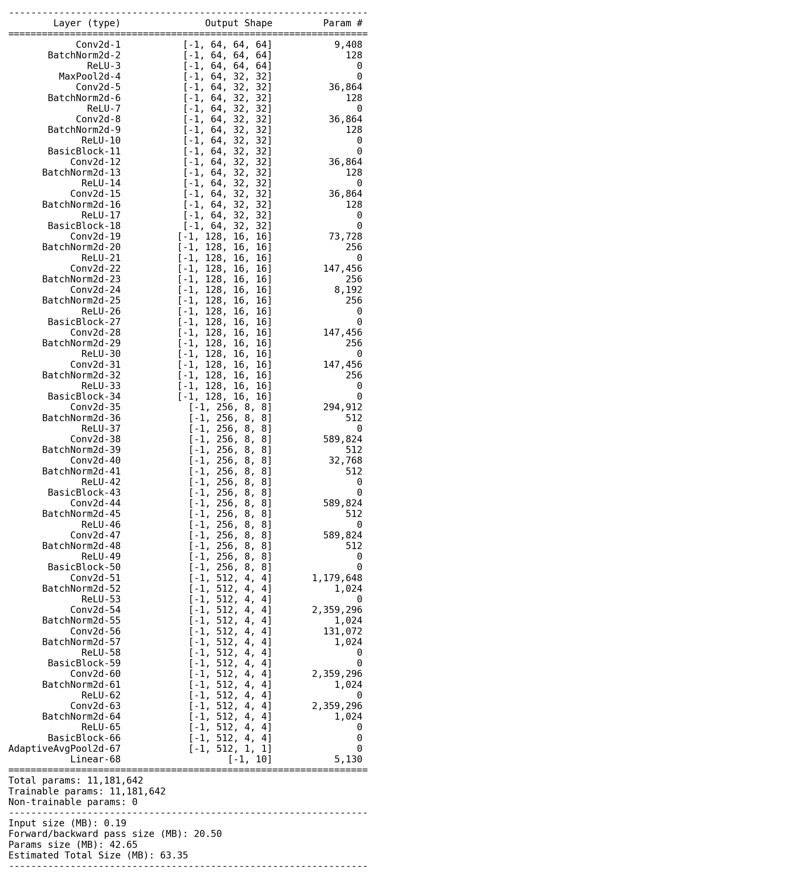
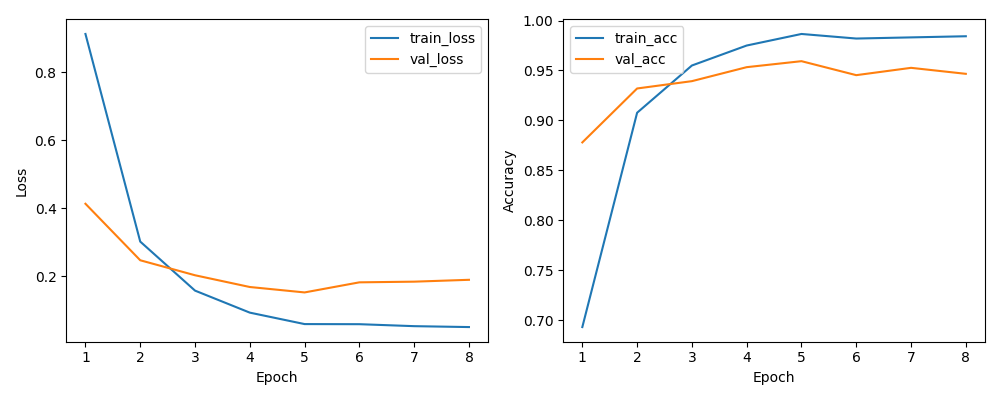

# 차량 이미지 분류 프로젝트 (ResNet18)

## 1. 프로젝트 개요
이 프로젝트는 **ResNet18 pretrained 모델**을 활용하여 다양한 교통수단 이미지를 분류하는 실험입니다.  
목적은 실제 수사/교통 관련 데이터를 바탕으로 차량 종류를 자동으로 구분할 수 있는 모델을 구축하고 성능을 검증하는 것입니다.

- 클래스: `bus`, `taxi`, `motorcycle`, `bicycle`, `truck`, `e_scooter`, `police_car`, `ambulance`, `van`, `construction_vehicle`  
- 입력 이미지 크기: 128x128
- 학습 방식: 전체 학습(fine-tuning), 마지막 Linear 레이어만 클래스 수에 맞게 조정
- 학습 중 Early stopping 적용 (patience=3)
- 학습 완료 시 best model 저장

---

## 2. 데이터셋 구성

- 총 데이터셋: 각 클래스 약 1000장 (다운로드+증강 포함)  
- Train/Validation/Test 비율: 70% / 15% / 15%  

| 데이터셋 | 이미지 수 |
|-----------|-----------|
| Train     | 7000      |
| Validation| 1500      |
| Test      | 1500      |

- 데이터 전처리:
  - 크기 조정: 128x128
  - 랜덤 수평 뒤집기, 회전, 색상 변화 등 증강 적용
  - 중복 이미지 및 깨진 이미지 제거

---

## 3. 학습 환경

- GPU: NVIDIA RTX 3080 Ti (CUDA 지원)
- PyTorch: 2.x
- Python: 3.10+
- CPU, RAM: 환경에 따라 다름

---

## 4. 모델 구조

- Pretrained ResNet18 기반 fine-tuning
- 마지막 fc layer만 클래스 수에 맞게 변경 (10 classes)
- CrossEntropyLoss + Adam optimizer
- ReduceLROnPlateau 스케줄러 사용

- 학습 완료 후 모델 summary 이미지:
  

---

## 5. 학습 결과

- 에포크: 최대 100, Early stopping으로 Epoch 8에서 종료
- Train/Validation Loss & Accuracy:
  

- 최종 Test 결과:
  - Test Loss: 0.1100
  - Test Accuracy: 96.33%

---

## 6. 한계 및 개선점

- **한계**
  - 클래스별 데이터 수가 동일하지 않아 일부 클래스에서 데이터 편향 가능
  - 다운받은 이미지 품질 및 환경 다양성 제한
  - 단일 ResNet18 사용, 더 깊거나 최신 모델 대비 성능 한계 존재

- **개선점**
  - 더 많은 데이터 확보 및 다양한 촬영 환경 반영
  - EfficientNet, Swin Transformer 등 최신 모델 실험
  - 데이터 증강 기법 다양화 및 자동 하이퍼파라미터 튜닝
  - 클래스 불균형 문제 해결을 위한 Weighted Loss 또는 Oversampling 적용

---

## 7. 참고 사항

- 학습 환경:
  - GPU: NVIDIA RTX 3080 Ti (CUDA 지원)
  - PyTorch 버전: 2.x
  - CPU, RAM: 학습 환경에 따라 달라질 수 있음
- 모델:
  - Pretrained ResNet18 기반 fine-tuning
  - 입력 이미지 크기: 128x128
  - Early stopping 적용, best model 저장
- 데이터셋:
  - 각 클래스별 약 1000장, Train/Validation/Test = 70%/15%/15%
  - 증강 및 깨진 이미지 제거 적용